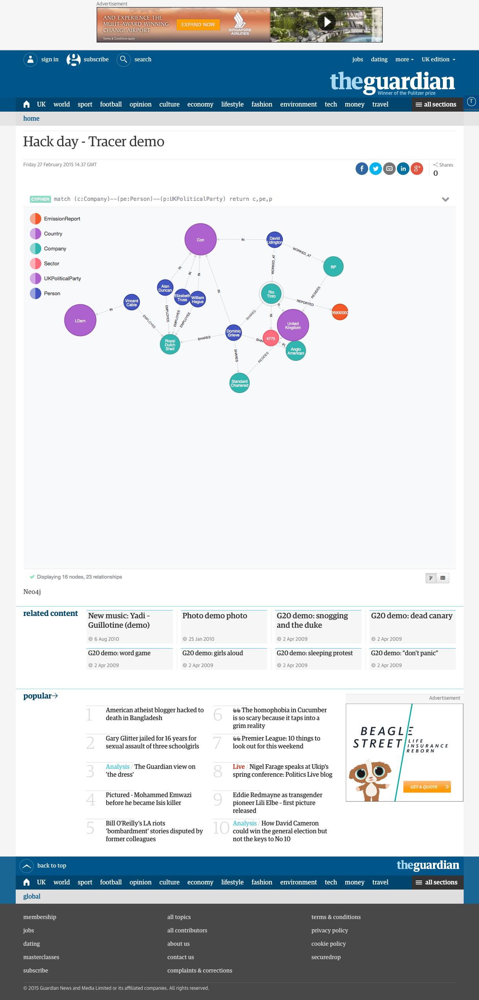

# tracer

Inferring culpability through the complex web of politics and institutions

## Possibilities

- Investigative journalism tool
- Find indirect conflicts of interest
- Create an open dataset of corporate and political interests
- Crowdsource political-corporate connections
- Website navigation for topic and profile pages.  

# Demo
## Queries for the demo

Companies and their emissions:

    match (x:Country)--(co:Company)--(er:EmissionReport) where er.scope1>1000000  RETURN x,co LIMIT 50

Sum of emissions:

    MATCH (country:Country)--(company:Company)--(report:EmissionReport)
    RETURN country.name AS country_name, sum(report.scope1) AS direct, sum(report.scope2) AS indirect
    ORDER BY indirect DESC

Political parties:

    match (pa:UKPoliticalParty)--(p:Person) WHERE p.name =~ '.*a.*' return pa, p limit 50

Political parties sum of expenses:

    MATCH (party:UKPoliticalParty)--(person:Person)--(expense:ParliamentaryExpense)
    RETURN party.name, sum(expense.amount) AS amount
    ORDER BY amount DESC
    LIMIT 10

Link them together:

    match (es:EmissionReport)--(c:Company)--(pe:Person)--(p:UKPoliticalParty) return es,c,pe,p

## Demo screen grab

